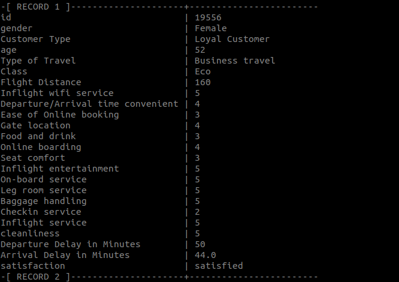

# AI-Tables in PostgreSQL

Anyone that has dealt with Machine Learning understands that data is a fundamental ingredient to it. Given that a great deal of the world’s organized data already exists inside databases, doesn't it make sense to bring machine learning capabilities straight to the database itself? Bringing Machine Learning to those who know their data best can significantly augment the capacity to solve important problems.
To do so, we have developed a concept called AI-Tables.

## What is AI Tables

AI-Tables differ from normal tables in that they can generate predictions upon being queried and returning such predictions as if it was data that existed in the table. Simply put, an AI-Table allows you to use machine learning models as if they were normal database tables, in something that in plain SQL looks like this:

```sql
SELECT <predicted_variable> FROM <ML_model> WHERE <conditions>
```

Now, in this tutorial you will get a step-by-step instructions on how to enable AI-Tables in your database and how to build, train and query a Machine Learning model only by using SQL statements!

<iframe width="560" height="315" src="https://www.youtube.com/embed/L4Hr0e2K1tc" frameborder="0" allow="accelerometer; autoplay; clipboard-write; encrypted-media; gyroscope; picture-in-picture" allowfullscreen></iframe>

## How to install PostgreSQL?

If you don’t have PostgreSQL installed you can [download the installers](https://www.postgresql.org/download/) for various platforms from the official documentation.

## Example dataset

In this tutorial, we will use the [Airline Passenger Satisfaction dataset](https://www.kaggle.com/teejmahal20/airline-passenger-satisfaction?select=train.csv). If you have other datasets in your PostgreSQL database please skip this section. This dataset contains an airline passenger satisfaction survey and we will try yo predict the passenger satisfaction based on the other factors in the data.

#### Import dataset to PostgreSQL
First, let's create a us_consumption table.

```sql
-- public.airline_passenger_satisfaction definition
CREATE TABLE public.airline_passenger_satisfaction (
	id numeric NULL,
	gender varchar NULL,
	"Customer Type" varchar NULL,
	age numeric NULL,
	"Type of Travel" varchar NULL,
	"Class" varchar NULL,
	"Flight Distance" numeric NULL,
	"Inflight wifi service" numeric NULL,
	"Departure/Arrival time convenient" numeric NULL,
	"Ease of Online booking" numeric NULL,
	"Gate location" numeric NULL,
	"Food and drink" numeric NULL,
	"Online boarding" numeric NULL,
	"Seat comfort" numeric NULL,
	"Inflight entertainment" numeric NULL,
	"On-board service" numeric NULL,
	"Leg room service" numeric NULL,
	"Baggage handling" numeric NULL,
	"Checkin service" numeric NULL,
	"Inflight service" numeric NULL,
	cleanliness numeric NULL,
	"Departure Delay in Minutes" numeric NULL,
	"Arrival Delay in Minutes" numeric NULL,
	satisfaction varchar NULL
);
```

After you create the table, you can use the \copy command to import the data from the CSV file to PostgreSQL:

```
\copy usconsumption FROM '/path/to/csv/usconsumption.csv' DELIMITER ',' CSV
```

Or, if you are using pgAdmin, DBeaver or another SQL client just use the import from CSV file option from the navigation menu. To check if the data was successfully imported execute SELECT query:

```sql
SELECT * FROM airline_passenger_satisfaction LIMIT 10;
```



## Add Configuration

We have the data inside PostgreSQL, so the next step is to install PostgreSQL foreign data wrapper for MySQL. Please check the EnterpriseDB documentation on how to do that. The last step is to create the MindsDB’s configuration file. MindsDB will try to use the default configuration options like host, port, username for the PostgreSQL integration. In case you want to extend them or change the default values you need to add a config.json file. Create a new file config.json and include the following information:

```json
{
    "api": {
        "http": {
            "host": "0.0.0.0",
            "port": "47334"
        },
        "mysql": {
            "host": "127.0.0.1",
            "password": "",
            "port": "47335",
            "user": "root"
        }
    },
    "config_version": "1.3",
    "debug": true,
    "integrations": {
        "default_postgres": {
            "database": "postgres",
            "enabled": true,
            "host": "127.0.0.1",
            "password": "postgres",
            "port": 5432,
            "type": "postgres",
            "user": "postgres"
        }
    },
    "log": {
        "level": {
            "console": "DEBUG",
            "file": "INFO"
        }
    },
    "storage_dir": "storage/"
}
```

The values provided in the configuration file are:

* api['http’] -- This key is used for starting the MindsDB HTTP server by providing:
host(default 127.0.0.1) - The mindsdb server address.
* port(default 47334) - The mindsdb server port.
* api['mysql'] -- This key is used for database integrations that work through MySQL protocol. The required keys are:
    * user(default root).
    * password(default empty).
    * host(default 127.0.0.1).
    * port(default 47335).
* integrations['default_postgres'] -- This key specifies the integration type in this case default_postgres. The required keys are:
    * user(default postgres) - The Postgres user name.
    * host(default 127.0.0.1) - Connect to the PostgreSQL server on the given host.
    * password - The password of the Postgres account.
    * type - Integration type(mariadb, postgresql, mysql, clickhouse, mongodb).
    * port(default 5432) - The TCP/IP port number to use for the connection.
* log['level'] -- The logging configuration(not required):
console - "INFO", "DEBUG", ”WARNING”,  "ERROR".
* file - Log level to save in the log file.
* storage_dir -- The directory where mindsdb will store models and configuration.
That’s all for setting up the AI Tables in PostgreSQL.

### AutoML with AI Tables in PostgreSQL
Let’s start the MindsDB server:

```
python3 -m mindsdb --api=mysql --config=config.json
```

The arguments sent to MindsDB are:
* --api - That tells MindsDB which API should be started (HTTP or MySQL).
* --config - The path to the configuration file that we have created.
If everything works as expected you should see the following message:


Upon successful setup, MindsDB should create a new schema called mindsdb. 


In the mindsdb schema, two new tables should be created called commands and predictors. The mindsdb.predictors table is the table where MindsDB will keep information about trained and in training models.

### Train new Machine Learning Model

Training the machine learning model using MindsDB is quite simple. It can be done by executing the INSERT query inside the mindsdb.predictors table. In our example we want to predict the consumption from the us_consumption table, so let’s run the INSERT query as:

```sql
INSERT INTO mindsdb.predictors(name, predict, select_data_query) VALUES ('passenger_satisfaction_model', 'satisfaction', 'SELECT * FROM airline_passenger_satisfaction');
```

This query will create a new model called 'passenger_satisfaction_model', and a new table 'airline_passenger_satisfaction' inside mindsdb schema. The required columns(parameters) added in the INSERT for training the predictor are:
name (string) - the name of the predictor.
predict (string) -  the feature you want to predict, in this example it will be satisfaction.
select_data_query (string) - the SELECT query that will get the data from PostgreSQL.
training_options (dictionary) - optional value that contains additional training parameters. For a full list of the parameters check the [PredictorInterface](/PredictorInterface/#learn).

To check that the training successfully finished we can SELECT from mindsdb.predictors table and get the status:

```sql
SELECT * FROM mindsdb.predictors WHERE name='passenger_satisfaction_model';
```


The status complete means that training successfully finished. Now, let’s query the model. The trained model behaves like an AI Table and can be queried as it is a standard database table. To get the prediction we need to execute `SELECT` query and in the `WHERE` clause include the other features values as Customer Type, Type of Travel, Seat comfort etc. 

```sql
SELECT satisfaction AS predicted, satisfaction_confidence AS confidence FROM mindsdb.passenger_satisfaction_model WHERE  "Customer Type"='Loyal Customer' AND "Inflight wifi service"=5 AND "Type of Travel"='Business travel' AND "Class"='Eco';
```


In a second we should get the prediction back from MindsDB. So, MindsDB thinks that the value for consumption rate is around 0.87 with pretty much big confidence 97%. There is additional information that we can get back from MindsDB by selecting the explain column from the model as:

```sql
SELECT satisfaction AS predicted, satisfaction_confidence AS confidence, satisfaction_explain AS info FROM mindsdb.passenger_satisfaction_model WHERE  "Customer Type"='Loyal Customer' AND age=52 AND "Type of Travel"='Business travel' AND "Class"='Eco';
```

Now, apart from the predicted and confidence values, MindsDB will return additional 
Information in JSON format in the explain column:

```json
{
    "predicted_value": "satisfied",
    "confidence": 0.94,
    "prediction_quality": "very confident",
    "important_missing_information": ["id", "Flight Distance", "Inflight wifi service", "Online boarding", "Baggage handling"],
    "confidence_composition": {
        "age": 0.935
    },
    "extra_insights": {
        "if_missing": [{
            "Customer Type": "satisfied"
        }, {
            "Type of Travel": "satisfied"
        }, {
            "Class": "satisfied"
        }]
    }
}
```

The confidence_interval shows a possible range of values where consumption lies in. The important_missing_information shows the list of features that MindsDB things are quite important for better prediction, in this case, the “Flight Distance”, "Inflight wifi service", "Online boarding" or "Baggage handling". The extra_insights contains a list of rows that we have included in the WHERE clause and show the consumption value if some of those were missing.

Congratulations, you have successfully trained and queried the Machine Learning Model only by using SQL Statements. Note that even if we used PostgreSQL, you can still query the same model from the other databases too.
